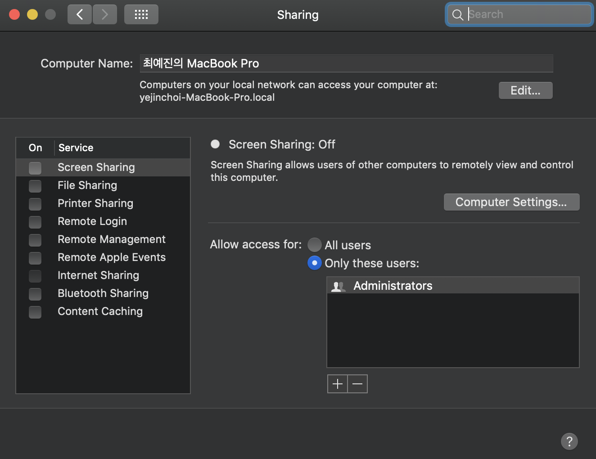

# Ubuntu에서 Mac으로 ssh 접속하기

  Mac으로 ssh 접속시, Connection Refused Error가 발생하는 경우가 있다. 이는 맥 서버에서 원격 로그인 허용을 하지 않아서 생기는 문제이다. 아래의 방식을 통해 원격 로그인 허용을 해줄 수 있다.

- System Preferences - Sharing 들어가기

- default는 Remote Login & Remote Management가 해제되어있음
- Remote Login & Remote Management 에 체크하여 On 으로 허용하기

- **System Preferences** -  **Sharing**

