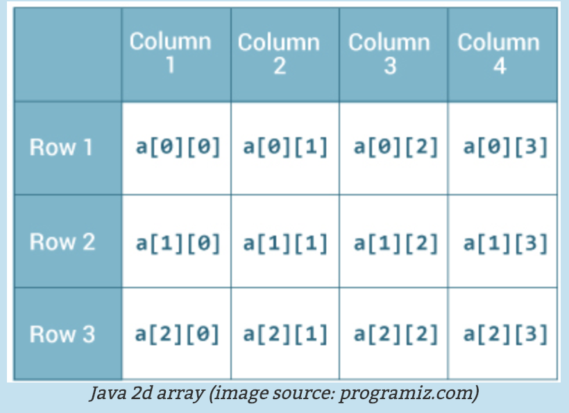
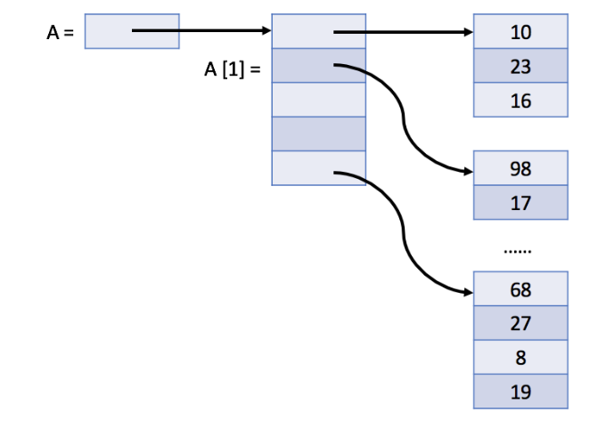

# 다차원배열 (Multi-dimensional array)

  배열을 구성요소로 하는 것이 `2차원 배열`이며, 2차원 배열을 구성 요소로 하는 것이 `3차원 배열`이다. 이러한 배열을 보통의 배열인 `1차원 배열` 과 구별하기 위해 **다차원배열** 이라고 한다. 다차원배열 중 가장 간단한 다차원 배열은 2차원 배열이다.


- 2차원 배열의 선언 및 생성

```java
int[][] a = new int[3][4];
```



- 3행 4열의 배열 a : 가로와 세로로 "**행**"과 "**열**"이 늘어선 **표** 의 이미지
- 2차원 배열의 각 요소는 `a[2][2]` 와 같이 접근


### 2차원배열 예제

```java
public class Main{
    private static void printArray(int[][] a) {
        for (int i=0;i<a.length;i++) {
            System.out.println(a[i]);
        }
        
        for (int i=0;i<a.length;i++) {
            for(int j=0;a[i] != null && j < a[i].length;j++) {
                System.out.print(a[i][j]+" ");
            }
            System.out.println();
        }
    }
    public static void main(String[] args) {
        System.out.println("Example 1 : ");
        int[][] a = new int[2][3];
        printArray(a);
        
        System.out.println("Exmaple 2 : ");
        int[][] b = new int[2][];
        printArray(b);
        
        System.out.println("Example 3 : ");
        b[0] = new int[3];
        b[1] = new int[5];
        printArray(b);
    }
}
```


## Java의 2차원 배열

  엄밀히 말하자면, Java는 다차원 배열이 없다. 왜냐하면 자바에서는 2차원 배열을 "**배열의 배열**" 로 생각하고, 3차원 배열을 "배열의 배열의 배열" 로 생각하기 때문이다. 따라서, 2차원배열 A의 형태는 다음과 같다고 할 수 있다.

> "각 요소가 N개의 정수 배열인" M개의 요소를 갖는 **1차원 배열**

- Java에서, 2차원 배열 A의 구조




## C++의 2차원 배열

  C++에서는 2차원 배열을 1차원 배열과 같은 형태로 저장한다. (linear)

- C++에서, M * N 배열 A의 구조


 C++에서는 위와 같이 M * N 개의 요소가 저장된 1차원 배열의 형태로 2차원 배열이 저장되기 때문에,  `A[i][j]` 는 `A[i*N+j]` 와 같은 의미로 해석된다.


## Dynamic 2D Array

  1차원 동적 배열과 유사하게, 2차원 동적 배열도 정의할 수 있다. `a nested dynamic array` 의 형태로 말이다!

