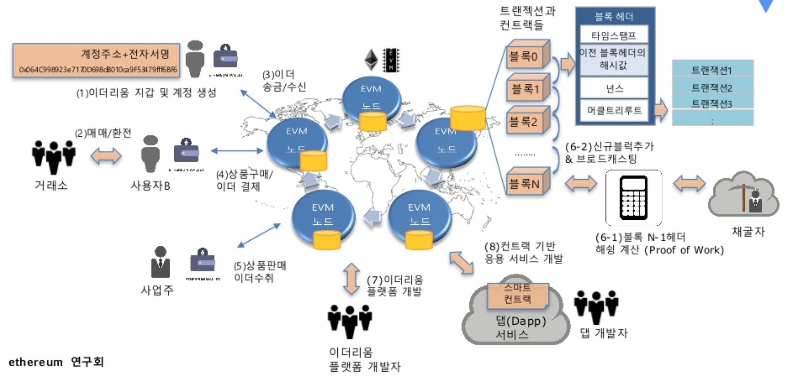
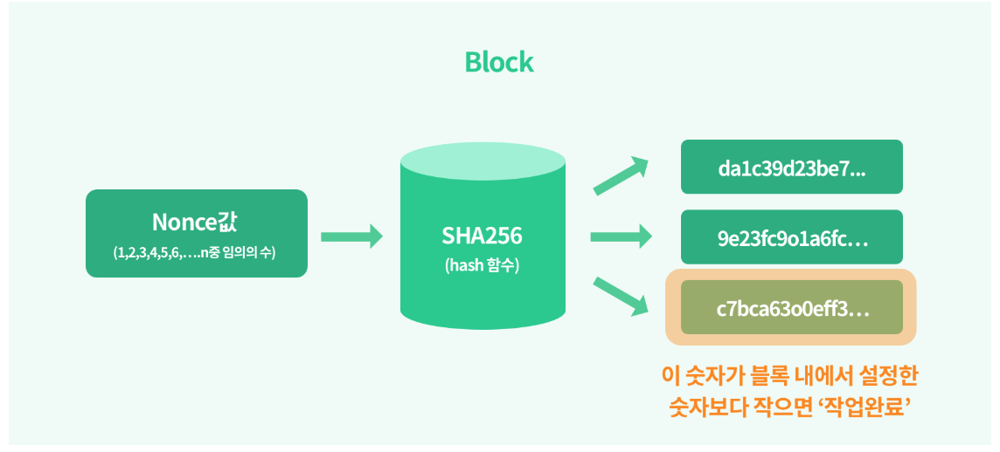

# 이더리움 플랫폼의 작동 원리

## 이더리움 플랫폼 살펴보기

  플랫폼이란, 일련의 소프트웨어 프로그램을 작동되게 하는 프레임워크를 말한다. 이더리움은 블록체인을 하나의 데이터베이스로 보고, 모든 자산(Asset)을 올릴 수 있고, 각 Asset이 구동되거나 거래되는 방식까지 직접 프로그래밍 할 수 있는 오픈 플랫폼이다. 


### 이더리움

  이더리움은, 정확히 프로그래밍 한 대로 작동하는 스마트 컨트랙트를 작동시키는 분산된 플랫폼이다. 스마트 컨트랙트는 무엇인가?

### Smart Contract (스마트 컨트랙트)

  Smart Contract는, 네트워크 상에서 신뢰할 수 없는 대상 간에 서로 합의한 계약을 준수하도록 강제하는 도구로, 간단히 말하자면, 특정 조건을 만족시키면 자동으로 실행되는 코드 조각이다. 실세계의 계약을 디지털화 하여 블록체인 위에 올려둔 것이라고도 볼 수 있는데, 실제 세계에서는 계약을 체결함에 있어, 자동으로 계약이 이행되지 않지만, 스마트 컨트랙트를 통해 자동으로 계약을 이행할 수 있고, 계약의 이해 관계자들에게 자동으로 규제를 가할 수도 있다. 이러한 Smart Contract는 새로운 컨트랙트를 생성하거나, 특정 Smart Contract 상의 함수를 실행한다거나, Ether (이더리움 화폐)를 전송하는 방식으로 실행된다.


### Ethereum 플랫폼의 작동 원리



[출처] : https://www.slideshare.net/jaehyun/1-block-chain-as-a-platform의 9 page

1. 사용자는 이더를 사용하기 위해 Mist 나 Ethereum Wallet을 설치함 

   - Wallet은 내부에 이더리움 클라이언트를 내장하고 있어서, 작동시 바로 이더리움 네트워크에 연결 & 계정 생성 (EOA)
   - passphrase를 입력하여 계정 생성
   - 최초 account가 만들어지면 그게 바로 main account가 됨 = etherbase
   - Etherbase?
     - 채굴에 대한 대가를 Ether로 지급받을 때, 기본 어카운트로 사용됨

2. 빗썸이나 업비트같은 외부 거래소에서 Ether를 구입

3. 다른 사용자에게서 Ether 받는 방법도 있음

4. 상품이나 서비스를 Ether로 구매할 수 있음

5. 상품이나 서비스를 판매하여 Ether를 획득할 수 있음

6. 채굴 : 블록을 새로 생성하는 일

   트랜잭션들을 모아 하나의 블록을 생성하는데, 그 블록을 validation 하는 작업이라고 볼 수 있음

   **정확히 말하면, 블록 헤더에 존재하는 해시값을 뛰어넘지 않는 최대 근사값을 찾는 행위 **

7. 이더리움 플랫폼 개발자들은 이더리움 플랫폼을 개발

8. Dapp 개발자들은 스마트 컨트랙트 기반의 응용 서비스를 개발


  이더리움에서 유저간의 송금이나 물건 구매 후 Ether를 지급하는 것은 바로 User 간의 Ether를 전이 시키는 것이다. 즉, 특정 시점에 특정 유저 account state를 다른 state로 전이시키는 셈이라고 할 수 있다. 이렇게, state 변화를 일으키는 모든 활동을 **transaction** 이라고 한다. 여러 트랜잭션 (transaction)이 모여 block이 되고, block을 시간순으로 연결하여 블록체인이 되는 것이다.


### 합의 알고리즘의 등장

  기존의 중앙 집중 원장에서는 중앙 은행이 각 트랜잭션의 이상을 알아채고, 이를 보장해준다. 그러나, 분산 공유 원장은 중앙의 인증 기관이 없는 형태이므로, 트랜잭션 도달에 시차가 발생할 수도 있다. 즉, 트랜잭션의 이상을 알아채기 힘들다. 따라서, 트랜잭션에 대해 해당 정보가 정확하고 문제가 없는지를 확인하기 위한 방법인 합의 알고리즘 (**Consensus Algorithm**) 이 필요하다.

  블록체인에서는 지연이나 미도달로 인해 발생하는 double spending(이중 지불) 등의 문제 해결을 위해 Consensus 알고리즘 이용한다. **Consensus Algorithm**을 통해 해당 트랜잭션 데이터가 정확하고 문제가 없는지를 확인하는 것이다.


### Ethereum의 Consensus Algorithm

  Ethereum에서의 Consensus는 PoW, Proof-of-Work, 작업 증명 알고리즘을 사용한다. PoW는 실제 수행하는 사람이 바로 Miner인 알고리즘으로, 채굴자(Miner)들은 컴퓨팅 연산을 통해 블록 헤더의 난이도 보다 적은 해시값을 찾아낸다. 해당 해시값을 찾으면, 모든 노드들에게 브로드캐스팅을 통해 이를 알린다. 가장 빠르게 이 해시값을 찾아내는 채굴자가 블록 당 3 Ether와 트랜잭션 내 수수료를 가져가는 방식이다.


### PoW (작업 증명)  vs  PoS (지분 증명)

- PoW (작업 증명 : Proof of Work)

  블록체인에 새로운 블록을 추가하려면, 그 새로운 블록의 블록 해쉬를 계산해내야하고, 그 블록 해쉬를 계산해내려면 그 블록의 블록 헤더 정보 중의 하나인 `nonce`값을 계산을 통해 구해야 한다.

  - 결국 ```nonce``` 값 구하기
  - ```nonce```값을 해시 입력값 중 하나로 하여, 계산되는 해시값이 특정 숫자보다 작아지면 됨 ==> 이게 블록을 블록체인에 추가하는 것


  

  - 특정 숫자 : 난이도에 의해 결정되는 값

  - 난이도는 블록 헤더의 ```Bits``` 를 통해 조절됨

  - PoW에서는 **가장 빨리 채굴된 블록만 인정을 받고 나머지는 버려지게 되기 때문에 이중지불 문제가 해결**됨

    > 여기서 PoW에 대해 의문점은 거대 자본가가 슈퍼컴퓨터를 구입하여 연산을 돌린다면 분산된 장부작성 방식이 아닌 중앙집권적 방식이 되지 않을까 할 수 있음
    > 그러나, 과반수의 해시파워를 가진 컴퓨터를 구매하는 건 엄청나게 많은 돈이 들어간다. 만약 천문학적인 돈을 투자하여 구매했다 하더라도, 거래가 위조되고 부당한 장부라고 느낀다면 해당 블록체인의 가치가 급락할 것이기 때문에 정당한 방식으로 네트워크를 운영하는 것이 훨씬 큰 이득이다.

    - 장점

      > 서비스 남용을 쉽게 방지
      >
      > 강력한 보안성

    - 단점

      > 난이도가 높아짐에따라 고사양 장비가 필요 (GPU) --> 에너지 낭비의 문제
      >
      > 지속적으로 해시파워를 유지해야 함
      >
      > 개인 채굴자는 보상을 얻기 힘들어짐 (채굴의 기업화로 인해)

      

- PoS (지분 증명 : Proof of Stake)

  PoS는, PeerCoin에서 처음 등장한 합의 알고리즘으로, 본인이 소유한 코인 지분으로 채굴하는(블록을 생성하는) 방식이다. PoS는 다음과 같은 특징을 갖는다. 

  - 코인을 가지고 있는 사용자가 현재 보유하고 있는 자산 (stake)에 비례하여 블록을 생성할 권한을 더 많이 부여

  - 블록 생성자와 지분 생성자의 이해관계를 일치시킴으로써 블록을 나쁜 의도로 생성할 동기부여를 없애며, 잘못 생성할 경우 패널티를 부여
    - 장점

      > 해시파워가 많이 필요하지 않아 에너지 낭비가 적음

    - 단점

      > 지분을 51% 가지고 있는 A 사용자가 자기의 이익에 반하는 B 사용자의 자산을 삭제해서 A가 B의 자산 을 0으로 만들어버릴 수도 있음
      >
      > 모두 이자를 받으려고 코인을 묶어놓기 때문에 시중 코인의 유통량 감소로 이어질 수 있음

  - 그럼에도 PoS로 전환하려는 이유

    > - PoW에서 51%의 해시파워를 가지는 비용 = 약 2500억원
    >
    > - PoS에서 전 세계 자산의 51% = 약 25조원
    >
    > ==> PoS가 중앙집권화가 더 어렵다는 이점이 있음


[Reference]

박재현, 오재훈, 박혜영. (2018). **코어 이더리움 프로그래밍**. 경기도 파주시: 주식회사 제이펍.
